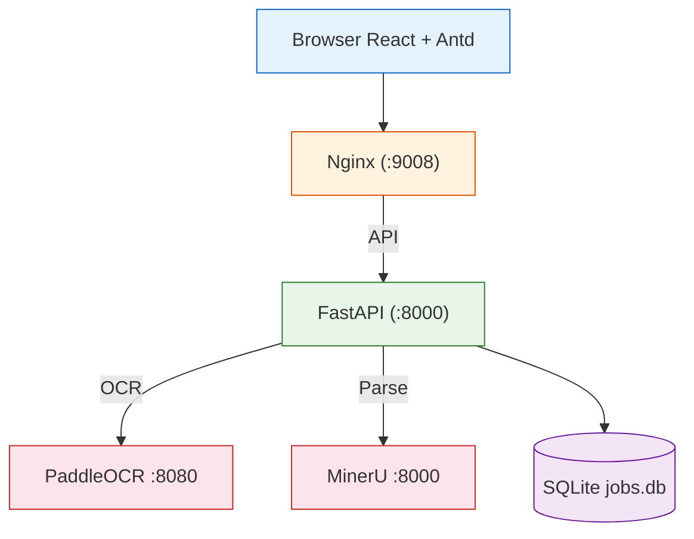
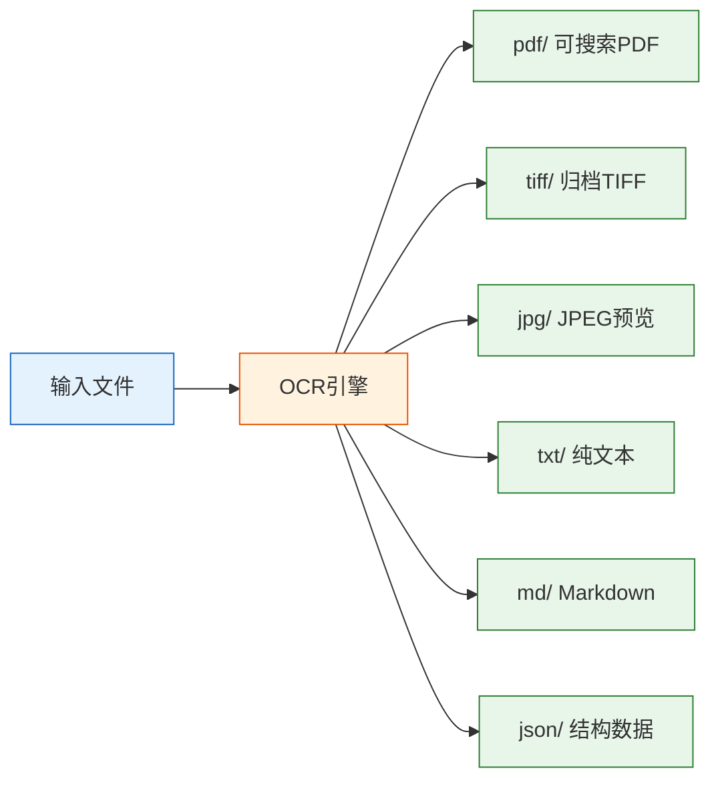
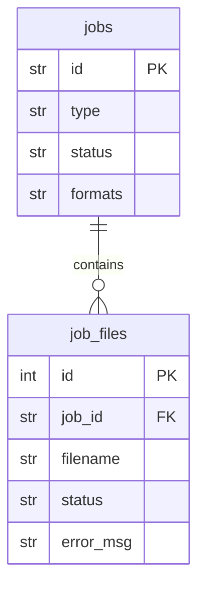

# 系统架构

## 整体架构

系统采用前后端分离架构，浏览器通过 Nginx 反向代理访问前端静态资源和后端 API。后端 FastAPI 服务负责任务调度、OCR 引擎调用和多格式输出生成。



### 技术栈

| 层 | 技术 | 说明 |
|----|------|------|
| 前端框架 | React 19 + TypeScript 6 | Vite 8 构建 |
| UI 组件库 | Ant Design 6 | 6 种主题色 + 深色模式 |
| 后端框架 | FastAPI 0.136 + Python 3.11 | uvicorn 运行 |
| 数据库 | SQLite (aiosqlite) | 单机部署，无需额外服务 |
| OCR 引擎 | PaddleOCR + MinerU | 独立 HTTP 服务，按需调用 |
| 图像处理 | Pillow / pypdf / img2pdf | 格式转换和 PDF 生成 |
| 部署 | Docker Compose + Nginx | 一键启动 |

---

## API 路由

| 路由 | 方法 | 说明 |
|------|------|------|
| `/api/health` | GET | 健康检查，返回 PaddleOCR / MinerU 状态 |
| `/api/stats` | GET | 统计数据：总任务数、今日、成功/失败/处理中 |
| `/api/upload` | POST | 单文件上传，参数 `formats` 指定输出格式 |
| `/api/jobs/{id}` | GET | 查询单个任务状态和结果 |
| `/api/download/{id}/{file}` | GET | 下载处理结果文件 |
| `/api/batch` | POST | 创建批量任务：源目录 + 目标目录 + 格式 |
| `/api/batch` | GET | 批量任务列表 |
| `/api/batch/{id}` | GET | 批量任务详情（含每个文件的处理状态） |

---

## 处理流程

每个文件处理分为三步：选择 OCR 引擎 → 生成多格式输出 → 更新数据库。

### 第一步：按需选择 OCR 引擎

根据请求的输出格式，决定调用哪个 OCR 引擎：

| 请求格式 | 调用的引擎 | 原因 |
|---------|-----------|------|
| 可搜索 PDF | PaddleOCR | 需要精确文字坐标做透明覆盖层 |
| Markdown / TXT | MinerU | 需要文档结构理解（标题、表格、阅读顺序） |
| JSON | PaddleOCR + MinerU | 保留完整原始数据 |
| TIFF / JPEG | 不需要 OCR | 纯图像转换，跳过 OCR |

### 第二步：生成多格式输出



各格式写入目标目录下的独立子目录：

```
目标目录/
├── pdf/   -> document_searchable.pdf
├── tiff/  -> document.tiff
├── jpg/   -> document_p1.jpg, document_p2.jpg
├── txt/   -> document.txt
├── md/    -> document.md
└── json/  -> document.json
```

### 第三步：更新数据库记录

处理完成后更新 `jobs` 表的状态、已处理文件数、错误数。

### 任务状态流转

```
pending -> processing -> done    (全部成功)
                       -> failed  (全部失败)
                       -> done    (部分失败, error_count > 0)
```

---

## 数据库

### 表结构

| 表名 | 用途 | 关键字段 |
|------|------|---------|
| `jobs` | 任务主表 | id, type(single/batch), status, formats, 统计数据 |
| `job_files` | 任务文件明细 | filename, status, error_msg, result_path |

### 表关系



---

## 后端模块

```
backend/app/
├── main.py           路由注册 + 生命周期
├── config.py         环境变量配置
├── models.py         请求/响应模型
├── db.py             SQLite 封装
├── ocr.py            OCR 引擎客户端 + 调度器
├── tasks.py          后台任务处理
└── formatters/
    ├── pdf.py        可搜索PDF生成
    ├── tiff.py       归档TIFF输出
    ├── jpeg.py       JPEG预览图
    ├── txt.py        纯文本提取
    ├── md.py         Markdown输出
    └── json.py       JSON数据导出
```

### 模块依赖关系

| 模块 | 依赖 |
|------|------|
| `main.py` | ocr / tasks / db / models / config |
| `tasks.py` | ocr / db |
| `ocr.py` | formatters (注册表自动发现) / config |
| `db.py` | config |

---

## 前端组件

```
frontend/src/
├── App.tsx                根组件 (ConfigProvider + 主题)
├── main.tsx               入口
├── api/client.ts          Axios 封装
├── components/
│   ├── AppLayout.tsx      侧边栏 + 顶栏布局
│   ├── UploadZone.tsx     拖拽上传
│   ├── FormatSelector.tsx 输出格式选择
│   ├── JobList.tsx        任务列表
│   └── JobDetail.tsx      任务详情
└── pages/
    ├── Dashboard.tsx      仪表盘
    ├── SingleUpload.tsx   单文件上传
    └── BatchProcess.tsx   批量处理
```

### 页面功能

**仪表盘**：进入系统默认页面，展示 6 个统计卡片（总文档数、今日处理、成功/失败/处理中、任务总数）和最近处理记录列表。

**单文件上传**：选择输出格式 → 拖拽或点击上传 → 实时轮询处理状态 → 完成后显示下载链接。

**批量处理**：选择输出格式 → 输入源/目标目录 → 创建任务 → 后台逐文件处理，可查看每个文件的状态和错误信息。

---

## 部署

### 环境变量

| 变量 | 默认值 | 说明 |
|------|--------|------|
| `PADDLEOCR_URL` | `http://10.19.26.153:8080` | PaddleOCR 服务地址 |
| `MINERU_URL` | `http://10.19.26.153:8000` | MinerU 服务地址 |
| `BACKEND_PORT` | `8000` | 后端监听端口 |
| `BATCH_MAX_CONCURRENT` | `2` | 批量处理并发数 |
| `DATABASE_PATH` | `./data/jobs.db` | 数据库路径 |

### Docker

```bash
docker compose up -d --build
# 访问 http://<host>:9008
```

外部依赖：PaddleOCR (8080) 和 MinerU (8000)，需目标服务器网络可达。
