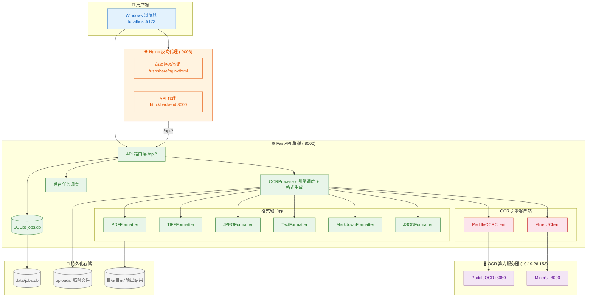
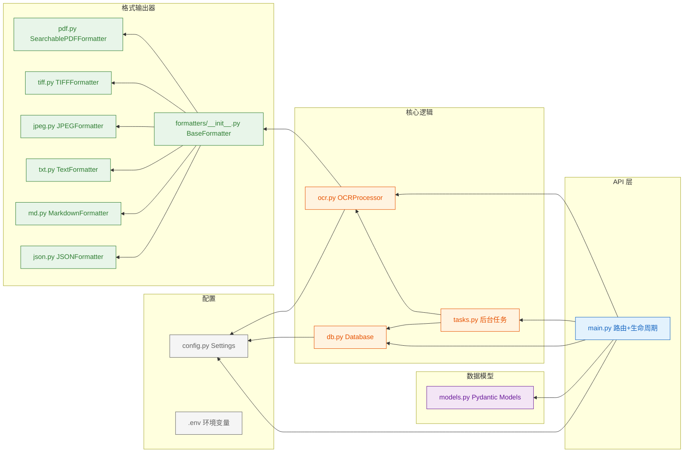
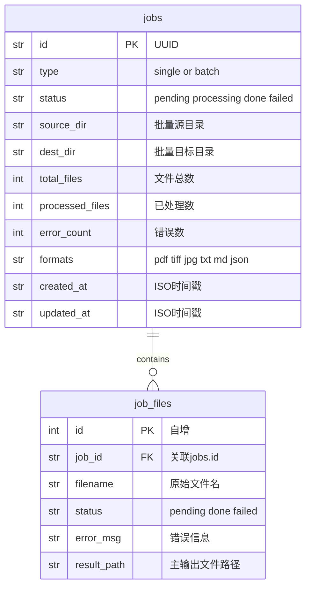
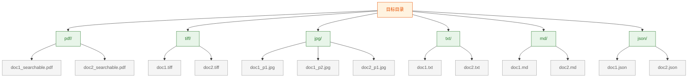
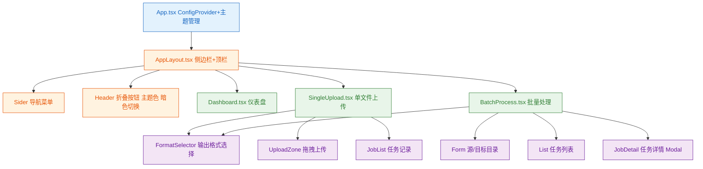

# 系统架构

## 整体架构



---

## 处理流水线

```mermaid
graph TB
    Start(["用户上传文件 或 指定批量目录"]) --> CreateJob["创建 Job 记录 写入 SQLite"]

    CreateJob --> EngineSelect{"按需选择 OCR 引擎"}

    EngineSelect -->|格式包含 PDF| PO_OCR["PaddleOCR 返回: 文字+坐标"]
    EngineSelect -->|格式包含 MD/TXT| MU_OCR["MinerU 返回: 标题/表格/阅读顺序"]
    EngineSelect -->|格式包含 JSON| Both["PaddleOCR + MinerU"]
    EngineSelect -->|仅 TIFF/JPEG| NoOCR["不调用OCR 直接图像处理"]

    PO_OCR --> Merge["合并 OCR 结果"]
    MU_OCR --> Merge
    Both --> Merge
    NoOCR --> Merge

    Merge --> MultiFormat{"逐个格式生成"}

    subgraph FormatGen["格式生成"]
        F1["PDFFormatter pypdf: 原图+文字层"]
        F2["TIFFFormatter Pillow: 多页TIFF+LZW"]
        F3["JPEGFormatter Pillow: 逐页JPEG预览"]
        F4["TextFormatter 按阅读顺序拼接"]
        F5["MarkdownFormatter MinerU结构转MD"]
        F6["JSONFormatter 完整数据+版式信息"]
    end

    MultiFormat -->|PDF| F1
    MultiFormat -->|TIFF| F2
    MultiFormat -->|JPEG| F3
    MultiFormat -->|TXT| F4
    MultiFormat -->|MD| F5
    MultiFormat -->|JSON| F6

    F1 --> OutDir["写入对应格式子目录"]
    F2 --> OutDir
    F3 --> OutDir
    F4 --> OutDir
    F5 --> OutDir
    F6 --> OutDir

    OutDir --> UpdateStatus["更新 Job 状态"]
    UpdateStatus --> Done(["处理完成"])

    classDef start fill:#e3f2fd,stroke:#1565c0,color:#1565c0
    classDef process fill:#fff3e0,stroke:#e65100,color:#e65100
    classDef engine fill:#fce4ec,stroke:#c62828,color:#c62828
    classDef format fill:#e8f5e9,stroke:#2e7d32,color:#2e7d32
    classDef output fill:#f3e5f5,stroke:#6a1b9a,color:#6a1b9a
    classDef end fill:#e8f5e9,stroke:#1b5e20,color:#1b5e20

    class Start start
    class CreateJob,EngineSelect,Merge,MultiFormat,NoOCR process
    class PO_OCR,MU_OCR,Both engine
    class F1,F2,F3,F4,F5,F6 format
    class OutDir,UpdateStatus output
    class Done end
```

---

## 模块依赖关系



---

## 数据库模型



---

## 输出目录结构



---

## 前端组件树


