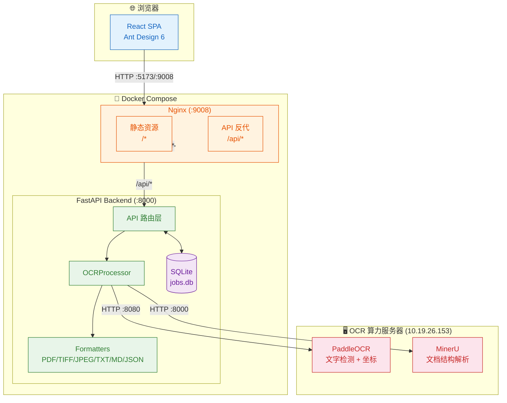
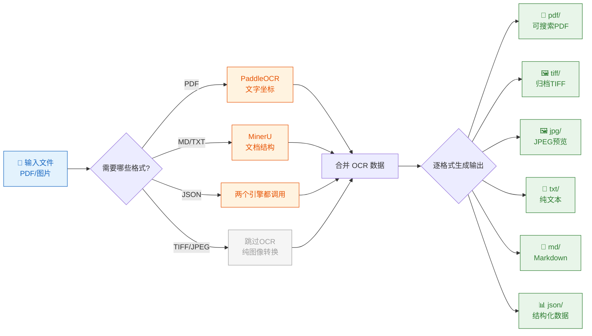
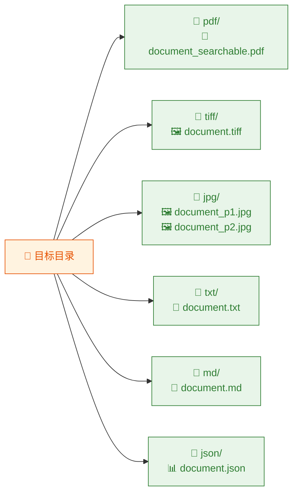
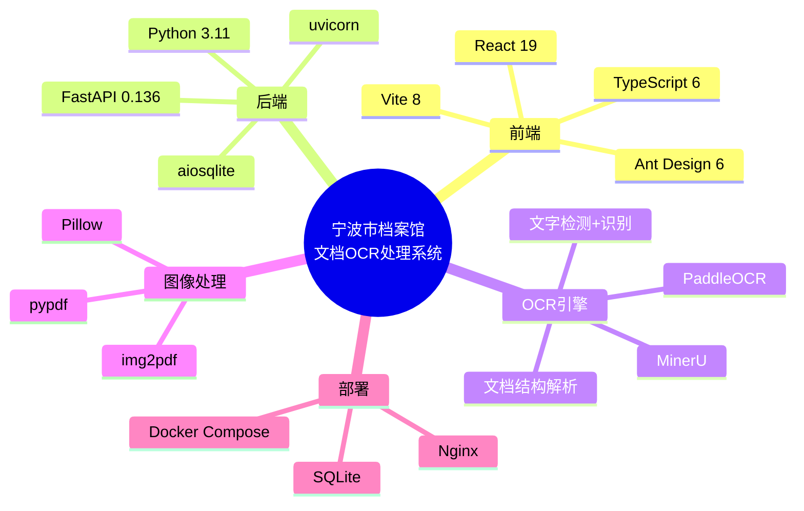

# 宁波市档案馆文档OCR处理系统

[](https://www.python.org/)
[](https://fastapi.tiangolo.com/)
[](https://react.dev/)
[](https://ant.design/)
[](LICENSE)

> 面向档案数字化的文档 OCR 处理系统。支持将扫描版 PDF / 图片转换为可搜索 PDF、TIFF 归档、JPEG 预览、纯文本、Markdown 及 JSON 结构化数据输出。

---

## 功能特性

- **多格式输出** — 一次处理同时生成 PDF / TIFF / JPEG / TXT / MD / JSON，按格式分目录存放
- **双引擎 OCR** — PaddleOCR（文字检测 + 精确坐标）+ MinerU（文档结构解析）
- **仪表盘** — 处理统计概览、今日任务量、成功率
- **批量处理** — 指定源目录，后台逐文件处理，自动记录进度
- **格式按需调用** — 仅对请求的格式调用对应的 OCR 引擎，TIFF/JPEG 无需 OCR
- **深色模式 + 6 种主题色切换**
- **Docker 部署** — 一键启动

---

## 系统架构



---

## 处理流程



---

## 快速启动

### 本地开发

```bash
# 后端
cd backend
python3 -m venv .venv && source .venv/bin/activate
pip install -r requirements.txt
uvicorn app.main:app --reload --host 0.0.0.0 --port 8000

# 前端（另一个终端）
cd frontend
npm install
npm run dev -- --host 0.0.0.0

# 浏览器打开 http://localhost:5173
```

### Docker 部署

```bash
docker compose up -d --build
# 访问 http://<host>:9008
```

---

## 配置

| 环境变量 | 默认值 | 说明 |
|---------|--------|------|
| `PADDLEOCR_URL` | `http://10.19.26.153:8080` | PaddleOCR 服务地址 |
| `MINERU_URL` | `http://10.19.26.153:8000` | MinerU 服务地址 |
| `BACKEND_PORT` | `8000` | 后端监听端口 |
| `MAX_UPLOAD_SIZE_MB` | `100` | 单文件上传大小限制 |
| `DATABASE_PATH` | `./data/jobs.db` | SQLite 数据库路径 |
| `UPLOAD_DIR` | `./uploads` | 上传临时目录 |
| `LOG_LEVEL` | `INFO` | 日志级别 |

完整配置见 `.env.example`。

---

## 输出目录结构



| 格式 | 文件名 | 说明 |
|------|--------|------|
| 可搜索 PDF | `*_searchable.pdf` | 原图 + 透明 OCR 文字覆盖层 |
| TIFF 归档 | `*.tiff` | 多页 TIFF，LZW 无损压缩 |
| JPEG 预览 | `*_p{页码}.jpg` | 每页一张预览图 |
| 纯文本 | `*.txt` | 按阅读顺序提取全部文字 |
| Markdown | `*.md` | 保留标题层级、表格结构 |
| JSON 数据 | `*.json` | 完整 OCR 数据 + 版式信息 |

---

## 技术栈


