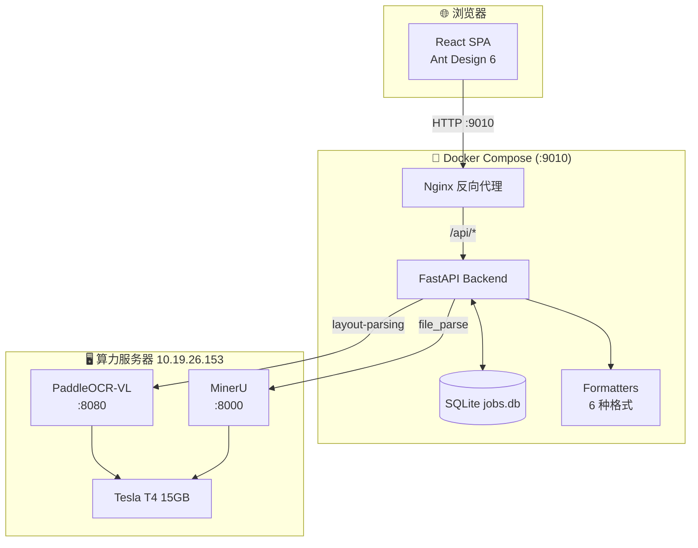
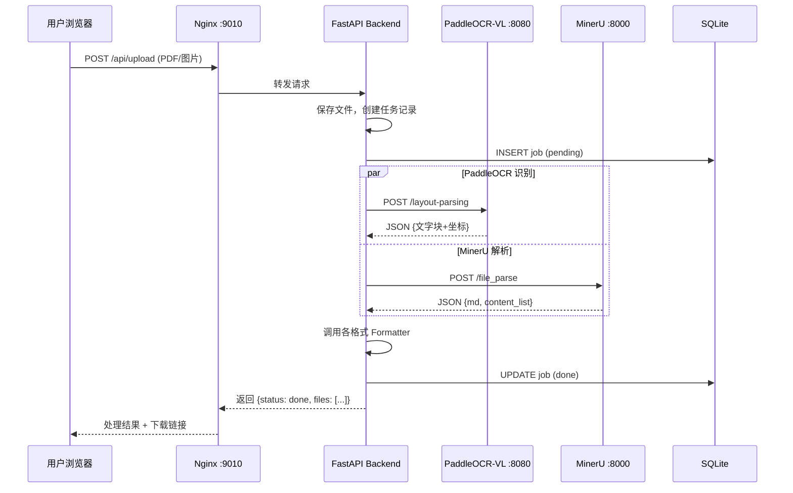

# 文档 OCR 处理系统 交付文档

> **版本**: v2.0  
> **日期**: 2026-06-18  
> **环境**: 算力服务器 `10.19.26.153` + 应用服务器 `10.19.26.148`

---

## 1. 系统概述

本系统将扫描版 PDF / 图片转换为多种可用格式。核心功能：

- **可搜索 PDF** — 保留原始图像视觉，叠加 OCR 隐藏文字层，支持 Ctrl+F 搜索和复制
- **多格式输出** — 一次处理同时生成 PDF / TIFF / JPEG / TXT / MD / JSON，按格式分目录存放
- **双引擎 OCR** — PaddleOCR-VL（文字检测 + 精确坐标）+ MinerU（文档结构解析 + 阅读顺序）
- **批量处理** — 支持服务器目录批量扫描和本地上传两种模式

识别引擎采用百度开源的 **PaddleOCR-VL 0.9B**，在 OmniDocBench V1.5 综合评测中得分 92.6。

---

## 2. 系统架构



---

## 3. 服务器环境

### 3.1 算力服务器（推理节点）

| 项目 | 信息 |
|------|------|
| IP | 10.19.26.153 |
| GPU | NVIDIA Tesla T4 · 15360 MiB |
| CUDA | 12.2 |
| 部署方式 | Docker Compose |
| 服务 | PaddleOCR-VL (:8080) + MinerU (:8000, :7860) |

### 3.2 应用服务器（Web 服务节点）

| 项目 | 信息 |
|------|------|
| IP | 10.19.26.148 |
| CPU | 8 核，无 GPU |
| 内存 | 32 GB |
| 部署方式 | Docker Compose (`/opt/pdf2searchable-v2/`) |
| 访问端口 | 9010 |
| 数据存储 | Docker 命名卷（持久化，启停不丢失） |

> 旧版 (systemd 服务, 9008 端口) 已停用，由 Docker 版 (9010) 替代。

---

## 4. 算力服务器部署

### 4.1 PaddleOCR-VL

```
/opt/paddleocr-vl/
├── compose.yaml
└── pipeline_config_vllm.yaml
```

```bash
cd /opt/paddleocr-vl && docker compose up -d
curl http://localhost:8080/health    # 验证
```

**API**: `POST /layout-parsing` (JSON, base64 编码文件)

### 4.2 MinerU

```bash
cd /opt/mineru-server && docker compose --profile api --profile gradio up -d
curl http://localhost:8000/health    # 验证
```

**API**: `POST /file_parse` (multipart/form-data 文件上传)

---

## 5. 应用服务器部署

### 5.1 目录结构

```
/opt/pdf2searchable-v2/
├── docker-compose.yml
├── .env                     # 环境变量配置
├── backend/
│   ├── Dockerfile
│   ├── requirements.txt
│   └── app/
│       ├── main.py          # FastAPI 路由
│       ├── ocr.py           # PaddleOCR + MinerU 客户端
│       ├── tasks.py         # 处理任务调度
│       ├── db.py            # SQLite 数据库
│       ├── models.py        # 数据模型
│       ├── config.py        # 配置
│       └── formatters/      # 6 种输出格式
│           ├── pdf.py       # 可搜索 PDF
│           ├── tiff.py      # TIFF 归档
│           ├── jpeg.py      # JPEG 预览
│           ├── txt.py       # 纯文本
│           ├── md.py        # Markdown
│           └── json.py      # JSON 数据
├── frontend/
│   ├── Dockerfile
│   ├── nginx.conf
│   └── src/
│       ├── pages/
│       │   ├── Dashboard.tsx    # 仪表盘
│       │   ├── SingleUpload.tsx # 单页上传
│       │   └── BatchProcess.tsx # 批量处理
│       └── components/          # UI 组件
```

### 5.2 启动与管理

```bash
cd /opt/pdf2searchable-v2

# 首次构建启动
docker compose up -d --build

# 日常启动/停止（保留容器）
docker compose start
docker compose stop

# 查看状态
docker compose ps

# 查看日志
docker compose logs -f backend
docker compose logs -f nginx
```

### 5.3 配置

通过 `.env` 文件配置：

| 变量 | 默认值 | 说明 |
|------|--------|------|
| `PADDLEOCR_URL` | `http://10.19.26.153:8080` | PaddleOCR 服务地址 |
| `MINERU_URL` | `http://10.19.26.153:8000` | MinerU 服务地址 |
| `PADDLEOCR_TIMEOUT` | `600` | PaddleOCR 超时（秒） |
| `MINERU_TIMEOUT` | `600` | MinerU 超时（秒） |
| `MAX_UPLOAD_SIZE_MB` | `100` | 单文件大小限制 |

### 5.4 数据持久化

Docker Compose 定义了命名卷，数据独立于容器生命周期：

| 卷名 | 挂载路径 | 内容 |
|------|---------|------|
| `uploads` | `/app/uploads/` | 上传文件 + 处理结果 |
| `data` | `/app/data/` | SQLite 数据库（任务记录） |

> `docker compose down` 或 `stop` **不会**删除数据。只有 `docker compose down -v` 才会清除卷。

---

## 6. 处理流程



---

## 7. 输出格式

| 格式 | 文件名 | 说明 | 依赖引擎 |
|------|--------|------|---------|
| 可搜索 PDF | `*_searchable.pdf` | 原图 + 透明 OCR 文字覆盖层 | PaddleOCR |
| TIFF 归档 | `*.tiff` | 多页 TIFF，LZW 无损压缩 | 无（纯图像） |
| JPEG 预览 | `*_p{页码}.jpg` | 每页一张 1200px 宽预览图 | 无（纯图像） |
| 纯文本 | `*.txt` | 按 MinerU 阅读顺序提取全部文字 | MinerU |
| Markdown | `*.md` | 保留标题层级、表格结构 | MinerU |
| JSON 数据 | `*.json` | 完整 OCR 数据 + 版式信息 | 两个引擎 |

---

## 8. 批量处理

支持两种模式：

1. **服务器目录** — 输入 NAS/服务器上的目录路径，直接扫描处理
2. **本地上传** — 从电脑浏览器选择文件上传到服务器，再作为批量任务处理

---

## 9. 任务管理

- 处理记录持久化存储在 SQLite 数据库中
- 详情弹窗可查看每个格式的下载链接
- 支持单条删除和批量删除
- 结果文件永久保留在 `uploads` 卷中

---

## 10. 已知限制

| 限制 | 说明 |
|------|------|
| GPU 显存 | Tesla T4 仅 15GB，PaddleOCR + MinerU 占用约 11.7GB，切换场景需停掉其他服务 |
| 并发 | 单队列处理，后续请求排队等待 |
| OCR 超时 | 多页文档处理时间较长，已配置 600 秒超时 |
| 旋转扫描型 PDF | 对“横向底图 + `/Rotate 90/270`”的扫描件，双层 PDF 坐标仍需服务器环境继续验证 |
| 长文本块叠字 | 验收单等密集文本块在自研叠字方案中更容易出现写入失败或文字层不完整 |

### 10.1 2026-06-19 临时修正说明

已在代码中落地一轮保守修正，等待服务器环境验证：

- `backend/app/formatters/pdf.py`
  - 增加旋转页坐标映射
  - 修正长文本块 `insert_textbox()` 失败处理
  - 增加 fallback 叠字和日志统计
- `backend/app/tasks.py`
  - 单文件失败时补充 `job_files.error_msg` 落库
- 保留原始备份
  - `backend/app/formatters/pdf.py.bak`
  - `backend/app/tasks.py.bak`

### 10.1.1 已确认的历史路线

项目历史上至少实际走过两条双层 PDF 路线：

1. 直接在原 PDF 上叠隐藏文字层
2. 先将 PDF 渲染为图片，再以该图片重建 PDF 后叠文字层

其中第 2 条路线在 git 历史 `32db81e` 中有完整实现，说明它不仅是设想，而是确实进入过代码：

- `backend/app/ocr.py`
  - 对 PDF 逐页 `get_pixmap()` 渲染 PNG
  - 逐页将 PNG 发给 PaddleOCR
- `backend/app/formatters/pdf.py`
  - 以渲染图作为底图新建 PDF 页面
  - 再按 1:1 坐标叠加隐藏文字层

但该路线后来未保留为主线，结合桌面测试结果，推测原因是它未彻底解决问题，或其成品在保真度上不如“原 PDF 直接叠字”。

### 10.2 服务器验证顺序

1. 先用 `宁波市档案馆终端安全管理系统验收文档.pdf` 验证 270° 单页样本。
2. 再用 `14-2026_档案馆_终端安全管理_22000.pdf` 验证 90° 多页样本。
3. 检查搜索高亮是否与原文对齐。
4. 查看后端日志中的 `blocks / fitted / fallback` 统计，判断剩余问题属于坐标映射还是长文本块溢出。

### 10.3 桌面测试文件复盘

桌面上保留了多版验收文档生成结果，可作为问题演进参考：

| 文件 | 生成时间 | 页面旋转 | 字符分布 | 结论 |
|------|----------|----------|----------|------|
| `验收文档_可搜索版.pdf` | 2026-06-18 16:58:27 | `Rotate = 90` | `1006 / 0 / 623` | 已出现页级文字层缺失 |
| `验收文档_完美版.pdf` | 2026-06-18 17:05:18 | `Rotate = 0` | `1000 / 822 / 617` | 是当前最接近正确的一版 |
| `验收文档_最终版.pdf` | 2026-06-18 17:11:29 | `Rotate = 90` | `1006 / 0 / 623` | 又回到旋转页路线 |
| `验收文档_对齐版.pdf` | 2026-06-18 17:16:33 | `Rotate = 90` | `1006 / 0 / 0` | 比前两版更差，第三页文字层也丢失 |

该时间线说明：更晚的版本不一定更正确。`17:05` 左右生成的 `完美版` 反而更值得重点追溯其生成逻辑。

### 10.3.1 样本归档状态

为便于后续交接和服务器复现，代表性样本已归档到项目目录 `cases/`：

- `case01_raw_acceptance_rotate270.pdf`
- `case02_raw_acceptance_rotate90_multi.pdf`
- `case03_generated_perfect_rotate0.pdf`
- `case04_generated_alignment_failed.pdf`
- `case05_einvoice_text_layer_reference.pdf`

对应桌面临时生成测试 PDF 已清理，后续复现统一以项目内案例集为准。

### 10.4 路线建议

- 默认主路线：优先使用“原 PDF 上叠隐藏文字层”
  - 保真度更高
  - 更符合通用双层 PDF 的正统做法
- 特殊补救路线：仅针对“横向底图 + `/Rotate` + 无文本层”的扫描型 PDF 研究转正/重建流程
  - 作为特判，而不是所有 PDF 的默认处理方式

---

## 11. 版本历史

| 版本 | 日期 | 变更 |
|------|------|------|
| v1.0 | 2026-06-12 | 初始版本：PyMuPDF + PaddleOCR，单页 Web 服务，端口 9008 |
| **v2.0** | **2026-06-18** | Docker 化重构：FastAPI + React，6 格式输出，MinerU 集成，端口 9010 |

---

*文档生成于 2026-06-18 · PaddleOCR-VL · MinerU 3.1.9 · PyMuPDF 1.25*
